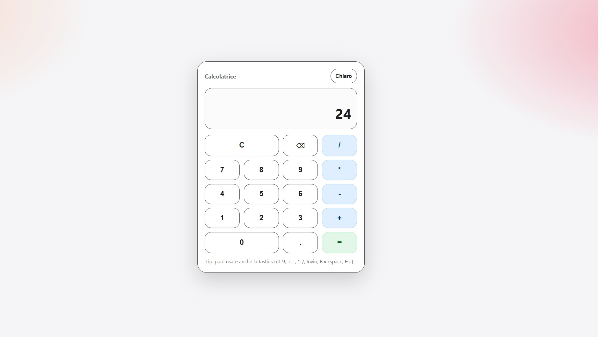
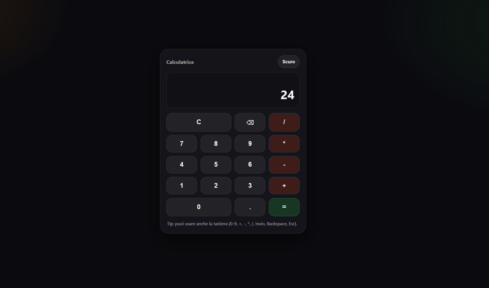

# Easy Calculator

Calcolatrice web minimale in stile Apple-like, costruita con **HTML + CSS + JavaScript**.  
Supporta **mouse**, **tastiera** e include un **toggle Light/Dark** basato su CSS variables (con persistenza in `localStorage`).

## Live Demo (GitHub Pages)

[Apri la demo](https://michelbranche.github.io/Easy-Calculator/)

Nota: se il link non corrisponde al tuo GitHub Pages, aggiorna l’URL qui sopra con quello reale.

## Features

- Operazioni base: **+ / - / * / /**
- **Decimali**
- **C** (clear) e **backspace** (cancella ultimo carattere)
- Supporto tastiera:
  - Numeri `0-9`
  - Operatori `+ - * /`
  - `.` per decimali
  - `Enter` o `=` per calcolare
  - `Backspace` per cancellare un carattere
  - `Esc` per reset
- UI responsive, pulita, con focus ring per accessibilità
- Tema **Light/Dark** con file dedicati e variabili CSS

## Tech Stack

- HTML5
- CSS3 (Grid + variabili CSS)
- JavaScript (DOM, event delegation, localStorage)

## Struttura del progetto

- `index.html`  
  Struttura della calcolatrice (display + griglia tasti) e bottone tema.

- `script.js`  
  Contiene:
  - logica calcolatrice (stato, input, compute)
  - gestione tastiera
  - toggle tema (cambio file CSS + salvataggio preferenza)

- `base.css`  
  Tutto il layout e lo stile dei componenti (card, display, tasti).  
  Qui NON ci sono colori hardcoded: prende tutto dalle variabili.

- `theme-light.css`  
  Solo variabili colore per il tema chiaro.

- `theme-dark.css`  
  Solo variabili colore per il tema scuro.

## Come eseguirlo in locale

### Metodo 1: Live Server (consigliato)
1. Clona il repo
2. Aprilo con VS Code
3. Avvia **Live Server** su `index.html`

### Metodo 2: apri direttamente il file
Apri `index.html` nel browser (funziona, ma Live Server è più comodo per sviluppare).

## Come funziona il tema (Light/Dark)

Il progetto usa due file tema separati (light e dark) che definiscono solo le variabili CSS.  
Quando premi il bottone “Tema”, JavaScript cambia l’`href` del link:

- `theme-light.css`
- `theme-dark.css`

La scelta viene salvata in `localStorage`, così al refresh rimane.

## Note di implementazione (da portfolio)

- **Event delegation**: un solo listener sul contenitore dei tasti, invece di un listener per ogni bottone.
- **Stato chiaro**: `current`, `previous`, `operation`.
- **Accessibilità**: `aria-live` nel display e focus ring visibile con tastiera.

## Roadmap (idee future)

- Percentuale `%`
- Cambio segno `+/-`
- Mini storico operazioni
- Animazioni leggere sui tasti (micro-interactions)
- Test di edge case (floating point)

## Autore

Michel Branche  
GitHub: https://github.com/MichelBranche

